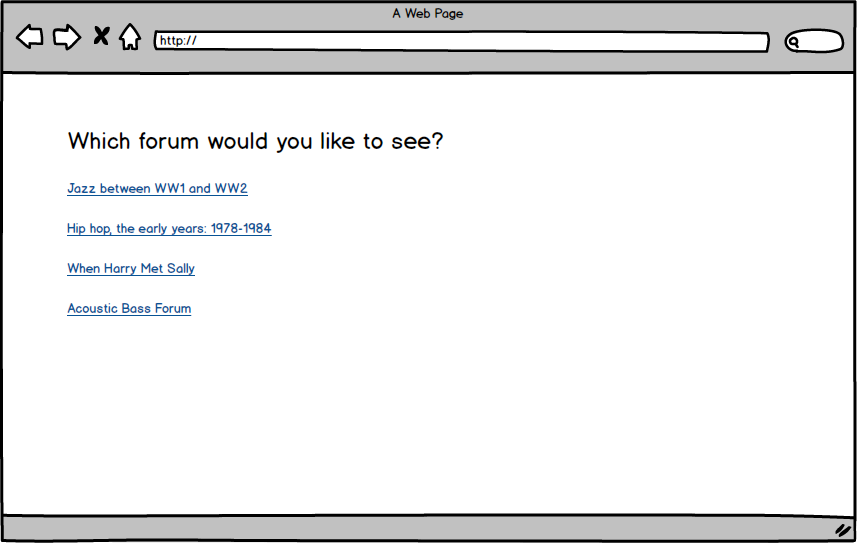
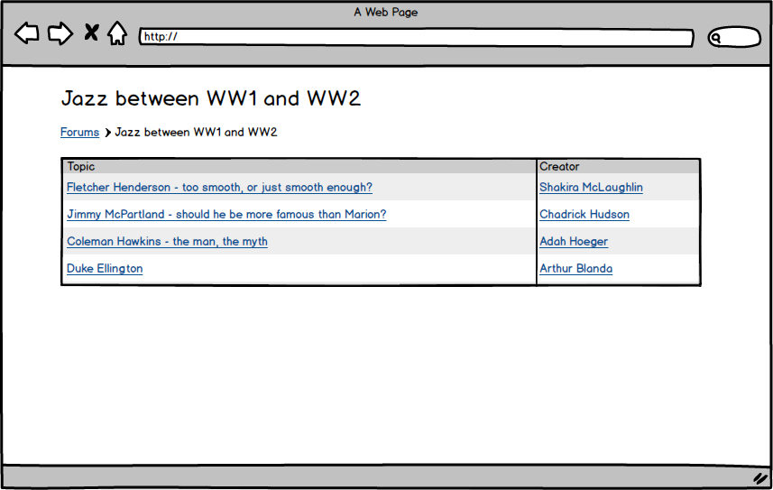
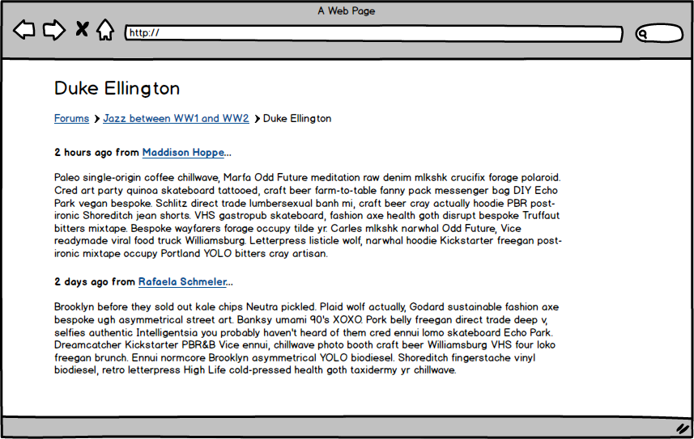
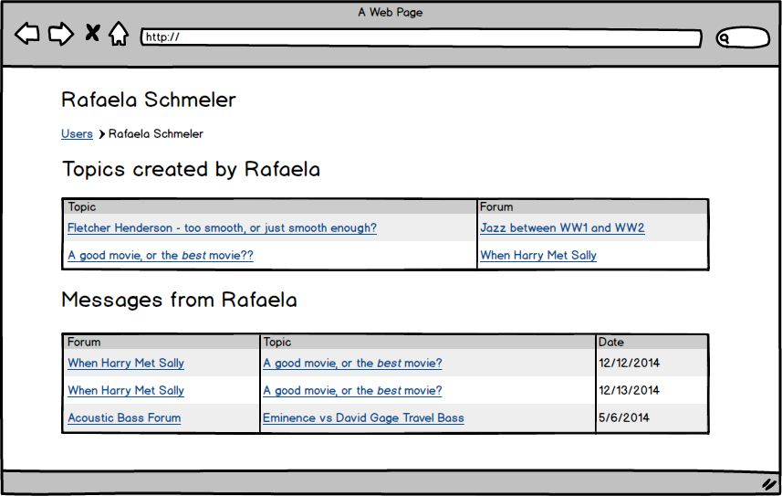

# Forum API

This forum has forums, topics, messages and users, and the relate like so:

* Forums have many topics
* Topics belong to a forum
* Topics belong to a user (the user who created the topic)
* Topics have many messages
* Messages belong to users

## Setup

* Clone
* Run `bin/setup`
* `rails s`
* Open Postman

## Goal

You need to serve all the data that each page needs, no more, no less, in one request.

Identify the data you need on each page, and make a route / controller to serve the data.

## Stories

**Users should see a list of forums**

Just forum names, and links to the forum.

**Users should be able to see a list of topics for a forum**

Each topic should list the title and the creator.

**Users should be able to see topic and all of its messages**

Each message shows the text and the creator.

**Users should be able to see a user's profile**

* Topics, along with the forum they are in
* Messages, along with the topic _and_ forum it was in

## Wireframes

## Extra Challenges

* Add pagination to all pages using the `meta` options in the serializer
